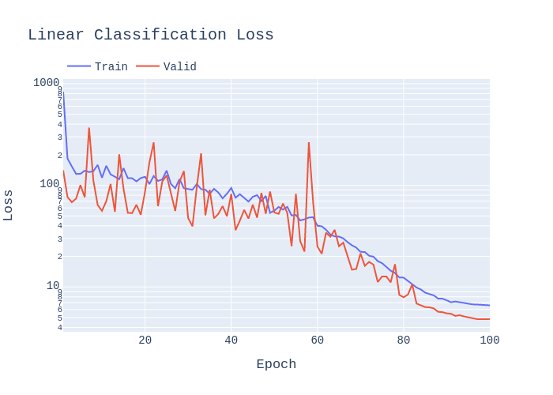

# Unofficial Pytorch Implementation of SimCLR

Unofficial Pytorch implemnentation of [SimCLR](https://arxiv.org/pdf/2002.05709.pdf): "A Simple Framework for Contrastive Learning of Visual Representations"

Work in progress, replicating results on ImageNet, TinyImageNet, CIFAR, STL10.

  * **Author**: Aiden Durrant
  * **Email**: adurrant@lincoln.ac.uk

### Results:

Top-1 Acc / Error of linear evaluation on CIFAR10:

Testing is performed on the CIFAR10 Val set, whilst the Train set is split into Train and Val for tuning.

| Method  | Batch Size | ResNet | Projection Head Dim. | Pre-train Epochs | Pretrain Optim | Finetune Optim |Eval Epochs | Acc(%) |
| ------------- | ------------- | ------------- | ------------- | ------------- | ------------- | ------------- | ------------- | ------------- |
| SimCLR + Linear eval. | 512 | ResNet18 | 128 | 1000 | LARS | SGD | 100 | 88.53 |
| SimCLR + Linear eval. | 512 | ResNet18 | 128 | 1000 | LARS | LARS | 100 | 90.47 |
| SimCLR + Linear eval. | 512 | ResNet34 | 128 | 1000 |  LARS | SGD | 100  | - |
| SimCLR + Linear eval. | 512 | ResNet34 | 128 | 1000 | LARS | LARS | 100  | - |
| SimCLR + Linear eval. | 512 | ResNet50 | 128 | 1000 |  LARS | SGD | 100  | - |
| SimCLR + Linear eval. | 512 | ResNet50 | 128 | 1000 | LARS | LARS | 100  | - |
| Supervised + Linear eval.| 512 | ResNet18 | 128 | 1000 | LARS | LARS | 100 | 93.63 |
| Random Init + Linear eval.| 512 | ResNet18 | 128 | 1000 | LARS | LARS | 100 | 26.37 |

**Note**: For Linear Evaluation the ResNet is frozen (all layers), training is only perfomed on the supervised Linear Evaluation layer.

### Plots:

**ResNet-18**




**ResNet-50**


## Usage / Run

### Contrastive Training and Linear Evaluation
Launch the script from `src/main.py`:

By default the CIFAR-10 dataset is used, use `--dataset` to select from: cifar10, cifar100, stl10, imagenet, tinyimagenet. For ImageNet and TinyImageNet please define a path to the dataset.

Training uses CosineAnnealingLR decay and linear warmup as stated in https://github.com/google-research/simclr/blob/master/lars_optimizer.py. The learning_rate is plotted below:


#### DistributedDataParallel

To train with **Distributed** for a slight computational speedup with multiple GPUs, use:

  `python -m torch.distributed.launch --nnodes=1 --node_rank=0 --nproc_per_node=2 --use_env main.py`


This will train on a single machine (`nnodes=1`), assigning 1 process per GPU where `nproc_per_node=2` refers to training on 2 GPUs. To train on `N` GPUs simply launch `N` processes by setting `nproc_per_node=N`.

The number of CPU threads to use per process is hard coded to `torch.set_num_threads(1)` for safety, and can be changed to `your # cpu threads / nproc_per_node` for better performance. ([fabio-deep](https://github.com/fabio-deep/Distributed-Pytorch-Boilerplate))

For more info on **multi-node** and **multi-gpu** distributed training refer to https://github.com/hgrover/pytorchdistr/blob/master/README.md

#### DataParallel

To train with traditional **nn.DataParallel** with multiple GPUs, use:

  `python main.py --no_distributed`

**Note:** The default config selects to use `--no_distributed`, therefore runnning `python main.py` runs the default hyperparameters without DistributedDataParallel.

### Linear Evaluation of a Pre-Trained Model

To evaluate the performace of a pre-trained model in a linear classification task just include the flag `--finetune` and provide a path to the pretrained model to `--load_checkpoint_dir`.

Example:

  `python main.py --no_distributed --finetune --load_checkpoint_dir ~/Documents/SimCLR-Pytorch/experiments/yyyy-mm-dd_hh-mm-ss/checkpoint.pt`

### Hyperparameters

The configuration / choice of hyperparameters for the script is handled either by command line arguments or config files.

An example config file is given at `SimCLR-Pytorch/config.conf`. Additionally, `.txt` or `.conf` files can be passed if you prefer, this is achieved using the flag `--c <PATH/TO/CONFIG.conf>`.

A list of arguments/options can be found below:

```
usage: main.py [-h] [-c MY_CONFIG] [--dataset DATASET]
               [--dataset_path DATASET_PATH] [--model MODEL]
               [--n_epochs N_EPOCHS] [--finetune_epochs FINETUNE_EPOCHS]
               [--warmup_epochs WARMUP_EPOCHS] [--batch_size BATCH_SIZE]
               [--learning_rate LEARNING_RATE]
               [--finetune_learning_rate FINETUNE_LEARNING_RATE]
               [--weight_decay WEIGHT_DECAY]
               [--finetune_weight_decay FINETUNE_WEIGHT_DECAY]
               [--optimiser OPTIMISER]
               [--finetune_optimiser FINETUNE_OPTIMISER] [--patience PATIENCE]
               [--temperature TEMPERATURE] [--jitter_d JITTER_D]
               [--jitter_p JITTER_P] [--blur_sigma BLUR_SIGMA BLUR_SIGMA]
               [--blur_p BLUR_P] [--grey_p GREY_P] [--no_twocrop]
               [--load_checkpoint_dir LOAD_CHECKPOINT_DIR] [--no_distributed]
               [--finetune] [--supervised]

Pytorch SimCLR Args that start with '--' (eg. --dataset) can also be set in a
config file (/home/msl/Documents/SimCLR-Pytorch/config.conf or specified via -c).
Config file syntax allows: key=value, flag=true, stuff=[a,b,c] (for details,
see syntax at https://goo.gl/R74nmi). If an arg is specified in more than one
place, then commandline values override config file values which override
defaults.

optional arguments:
  -h, --help            show this help message and exit
  -c MY_CONFIG, --my-config MY_CONFIG
                        config file path
  --dataset DATASET     Dataset, (Options: cifar10, cifar100, stl10, imagenet,
                        tinyimagenet).
  --dataset_path DATASET_PATH
                        Path to dataset, Not needed for TorchVision Datasets.
  --model MODEL         Model, (Options: resnet18, resnet34, resnet50,
                        resnet101, resnet152).
  --n_epochs N_EPOCHS   Number of Epochs in Contrastive Training.
  --finetune_epochs FINETUNE_EPOCHS
                        Number of Epochs in Linear Classification Training.
  --warmup_epochs WARMUP_EPOCHS
                        Number of Warmup Epochs During Contrastive Training.
  --batch_size BATCH_SIZE
                        Number of Samples Per Batch.
  --learning_rate LEARNING_RATE
                        Starting Learing Rate for Contrastive Training.
  --finetune_learning_rate FINETUNE_LEARNING_RATE
                        Starting Learing Rate for Linear Classification
                        Training.
  --weight_decay WEIGHT_DECAY
                        Contrastive Learning Weight Decay Regularisation
                        Factor.
  --finetune_weight_decay FINETUNE_WEIGHT_DECAY
                        Linear Classification Training Weight Decay
                        Regularisation Factor.
  --optimiser OPTIMISER
                        Optimiser, (Options: sgd, adam, lars).
  --finetune_optimiser FINETUNE_OPTIMISER
                        Finetune Optimiser, (Options: sgd, adam, lars).
  --patience PATIENCE   Number of Epochs to Wait for Improvement.
  --temperature TEMPERATURE
                        NT_Xent Temperature Factor
  --jitter_d JITTER_D   Distortion Factor for the Random Colour Jitter
                        Augmentation
  --jitter_p JITTER_P   Probability to Apply Random Colour Jitter Augmentation
  --blur_sigma BLUR_SIGMA BLUR_SIGMA
                        Radius to Apply Random Colour Jitter Augmentation
  --blur_p BLUR_P       Probability to Apply Gaussian Blur Augmentation
  --grey_p GREY_P       Probability to Apply Random Grey Scale
  --no_twocrop          Whether or Not to Use Two Crop Augmentation, Used to
                        Create Two Views of the Input for Contrastive
                        Learning. (Default: True)
  --load_checkpoint_dir LOAD_CHECKPOINT_DIR
                        Path to Load Pre-trained Model From.
  --no_distributed      Whether or Not to Use Distributed Training. (Default:
                        True)
  --finetune            Perform Only Linear Classification Training. (Default:
                        False)
  --supervised          Perform Supervised Pre-Training. (Default: False)
```

## Dependencies

Install dependencies with `requrements.txt`

  `pip install -r requrements.txt`

```
torch
torchvision
tensorboard
tqdm
configargparse
```

## References
  * T. Chen, et. al [SimCLR Paper](https://arxiv.org/pdf/2002.05709.pdf)


  * GoogleResearch [SimCLR](https://github.com/google-research/simclr/)


  * noahgolmant [pytorch-lars](https://github.com/noahgolmant/pytorch-lars)


  * pytorch [torchvision ResNet](https://github.com/pytorch/vision/blob/master/torchvision/models/resnet.py)


  * fabio-deep [Distributed-Pytorch-Boilerplate](https://github.com/fabio-deep/Distributed-Pytorch-Boilerplate)
